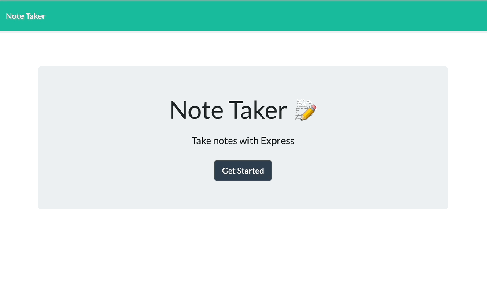

# notetaker


## Table of Contents 
- [Description](#description)
- [Technology](#technology)
- [Installation](#installation)
- [Usage](#usage)
- [Code](#code)
- [Contribution](#contribution)
- [Author](#author)

## Description
This application, called Note Taker, was created to write and save notes. The task was to add and populate a server.js file to existing starter code. The application retrieves user note data from a JSON file.

## Technology
This app was pre-built for us using HTML/CSS and Javascript. I had to do the backend using Express.js and the fs dependency.

## Installation
To install this generator, please download this repo onto your local computer. Then, make sure to:
- Install npm packages with `npm i`

## Usage
To use this application: 
- Open Terminal
- Type `node server.js` 
- Open your browser and type `http://localhost:3000` to open the app


Deployed link: https://glacial-tor-42217.herokuapp.com

## Code
This code shows how to set up Express so that you can create the routes.
```
const express = require("express");
const fs = require("fs");
const path = require("path");
const db = require("./db/db")

var app = express();
var PORT = process.env.PORT || 3001;

app.use(express.urlencoded({ extended: true }));
app.use(express.json());
app.use(express.static('public'));
```
This code shows how to call the get routes for index and notes.
```
app.get('/', function (req, res) {
    res.sendFile(path.join(__dirname, '/public/index.html'));
});

app.get('/notes', function (req, res) {
    res.sendFile(path.join(__dirname, '/public/notes.html'));
});
```

## Contribution
[](code_of_conduct.md)

## Author
- Github: [samyuhan](https://github.com/samyuhan)
- Email: syuhan@berkeley.edu
